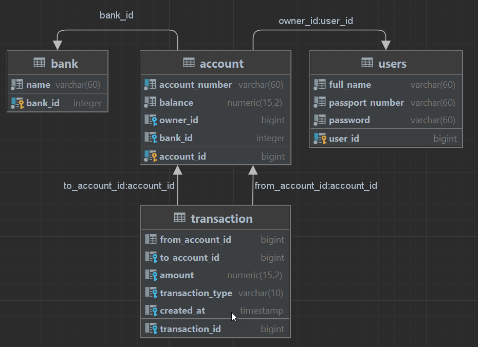
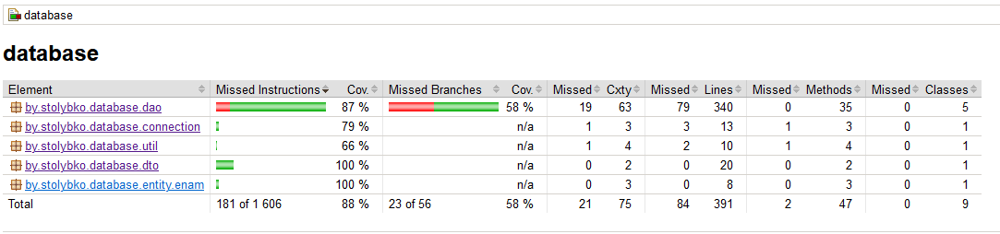

# console_bank_app

Проект представляет консольное банковское приложение, в котором реализованы функции:
- пополнения и снятия средств со счёта;
- перевод средств между счетами (перевод средств реализован в одну транзакцию);
- автоматическая проверка и начисление процентов на остаток счёта в конце месяца;
- автоматическое создание и сохранение чека банковской операции;
- CRUD операции для сущностей проекта с помощью GET и POST запросов.
___

Используемый стек
---
В проекте использован следующий стек технологий:
1. Java 17
2. Gradle
3. PostgreSQL
4. JDBS
5. Lombok
6. Servlets
7. TomCat 10.1.13
___

Инструкция по запуску
---
Для запуска проекта необходимо:  
- Отредактировать файл database/src/main/resources/applicationDB.yml, указав нужные имя пользователя и пароль базы данных (по умолчанию - postgres).   
- Создать и заполнить базу данных "console_bank" с помощью файла database/src/main/resources/db.sql.  
- В файле web/build.gradle указать свой путь к папке apache-tomcat-10.1.13/webapps/.  
- Запустить tomcat(файл startup.bat для windows).   
- Собрать проект с помощью таски assemble в Gradle (war файл проекта автоматически скопируется в папку webapps apache-tomcat'a и разархивируется).  
- Для запуска консольно приложения нужно запустить метод main класса service/src/main/java/by/stolybko/AppRunner.java   
___

Endpoints
---
CRUD операции выполняются GET или POST(с телом в формате JSON) запросом на url: http://localhost:8080/api/user (bank|account|transaction -для других сущностей).

- GET запрос на url без параметров - выводит список сущностей (формат JSON);  
- GET запрос на url с параметром id - выводит сущность с указанным id (формат JSON);  
- POST запрос без параметров - создает сущность;  
- POST запрос с параметром id - обновляет сущность с указанным id;  
- POST запрос с параметром delete - удаляет сущность с  id равным значению параметра delete;  

Примеры запросов:
~~~
вывод всех user'ов:
GET http://localhost:8080/api/user

вывод user'а по id:
GET http://localhost:8080/api/user?id=1

создание user'а:
POST http://localhost:8080/api/user
{
    "fullName": "Apolon Michailovich Snitko",
    "passportNumber": "308767HB134",
    "password": "123"
}

обновление user'а:
POST http://localhost:8080/api/user?id=1
{
    "fullName": "Apolon Michailovich Snitko",
    "passportNumber": "308767HB134",
    "password": "123"
}

удаление user'а:
POST http://localhost:8080/api/user?delete=1

создание bank'а:
POST http://localhost:8080/api/bank
{
    "name": "CleverBank"
}

обновление bank'а:
POST http://localhost:8080/api/bank?id=1
{
    "name": "CleverBank"
}

создание account'а:
POST http://localhost:8080/api/account
{
    "accountNumber": "1234567890",
    "userId": 1,
    "bankId": 1,
    "balance": 26370.04
}

обновление bank'а:
POST http://localhost:8080/api/account?id=1
{
    "accountNumber": "1234567890",
    "userId": 1,
    "bankId": 1,
    "balance": 1370.04
}

создание transaction:
POST http://localhost:8080/api/transaction
{
    "fromAccountId": 2,
    "toAccountId": 2,
    "amount": 20.00,
    "transactionType": "Insert",
}

обновление transaction:
POST http://localhost:8080/api/transaction?id=1
{
    "fromAccountId": 2,
    "toAccountId": 2,
    "amount": 20.00,
    "transactionType": "Insert",
}
~~~

Database
---
Схема базы данных:  

Tests
---

тестами покрыт только модуль Database, застрял на тестировании сервиса...

